Installing the Q64 VPN on Windows
===
Installing the VPN's certificate is the first step, this allows Windows to validate the authenticity of the VPN upon connection.
If follow this guide exactly, you will have no issues setting up the VPN.

1) Click the certificate link labeled Windows on your [account page](http://net.q64.co).  This will download the certificate.

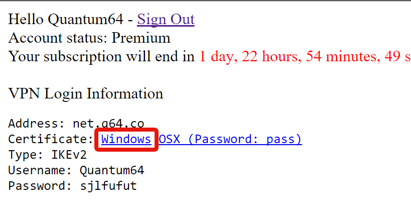

2) Click the downloaded certificate.

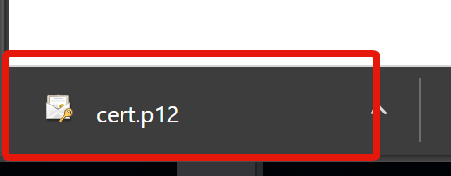

3) The import certificate window will open, CHANGE STORE LOCATION TO LOCAL MACHINE, then click next (if prompted for Admin access, grant it).

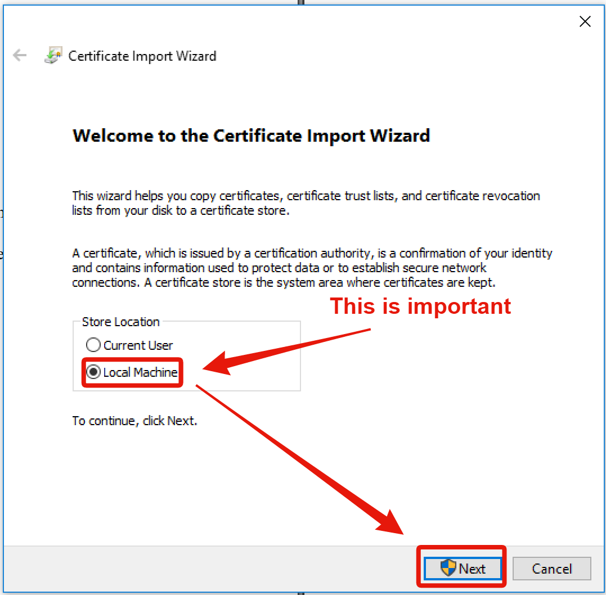

5) Continue clicking next until the certificate is installed, you do not need to change any other options.

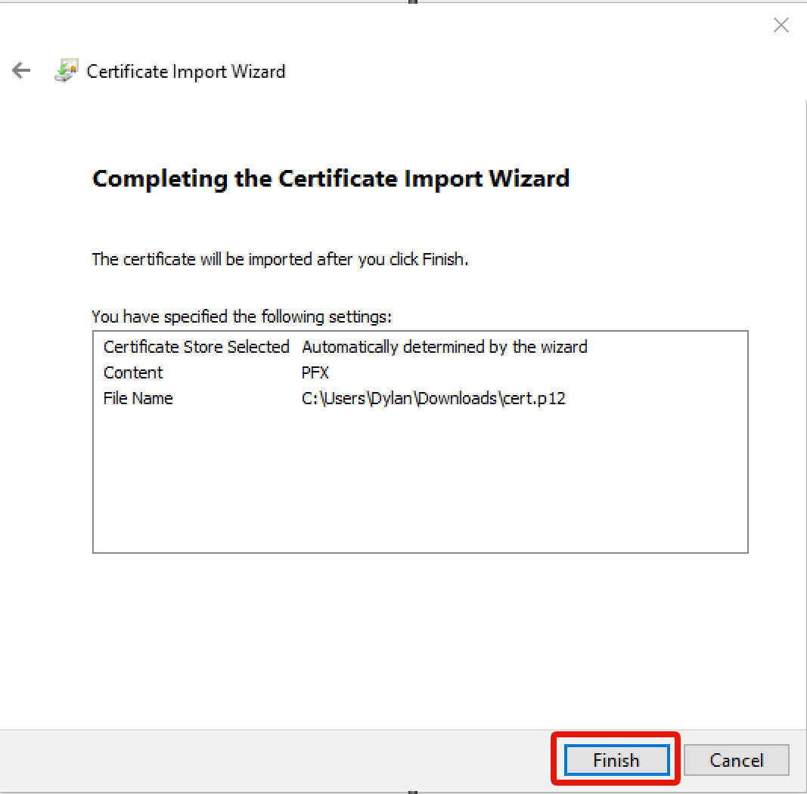

6) Click the start button, then click the gear icon above the start button.

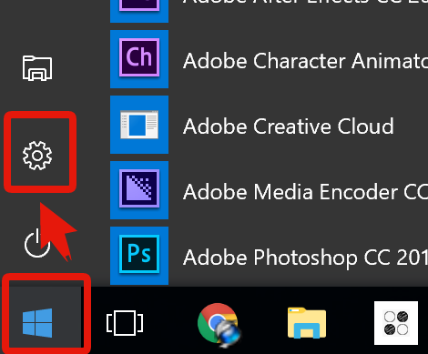

7) Click network.

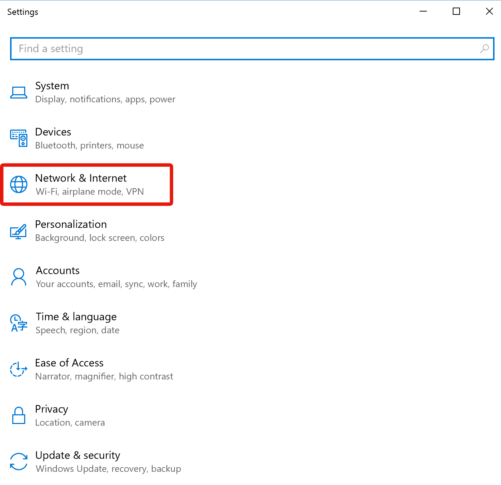

8) Click VPN.

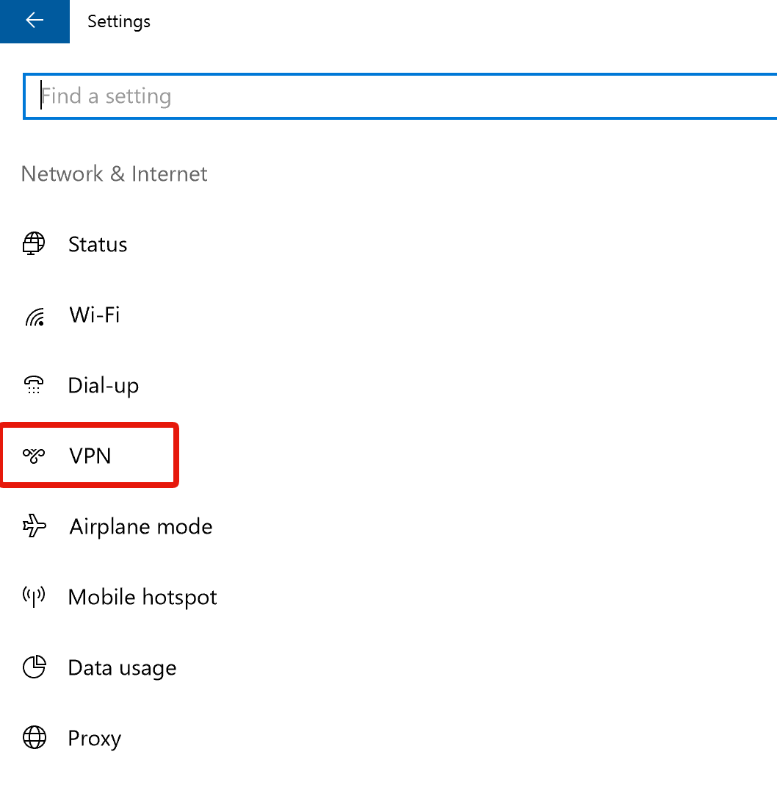

9) Click add VPN connection.

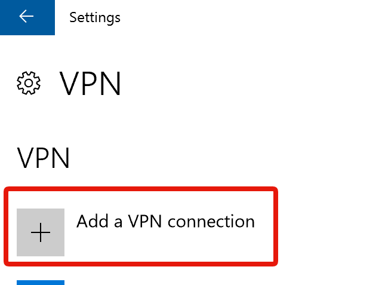

10) Copy the information from your [account page](http://net.q64.co) into the new window, then click Save.

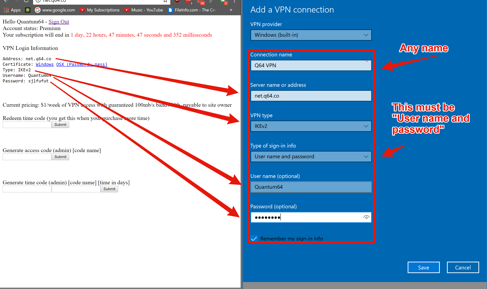

11) Click on the new VPN connection, then click Connect.

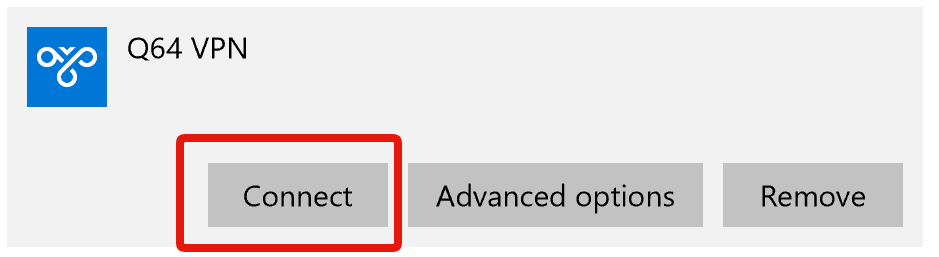

12) You are now connected to the VPN, confirm this by checking your IP address.

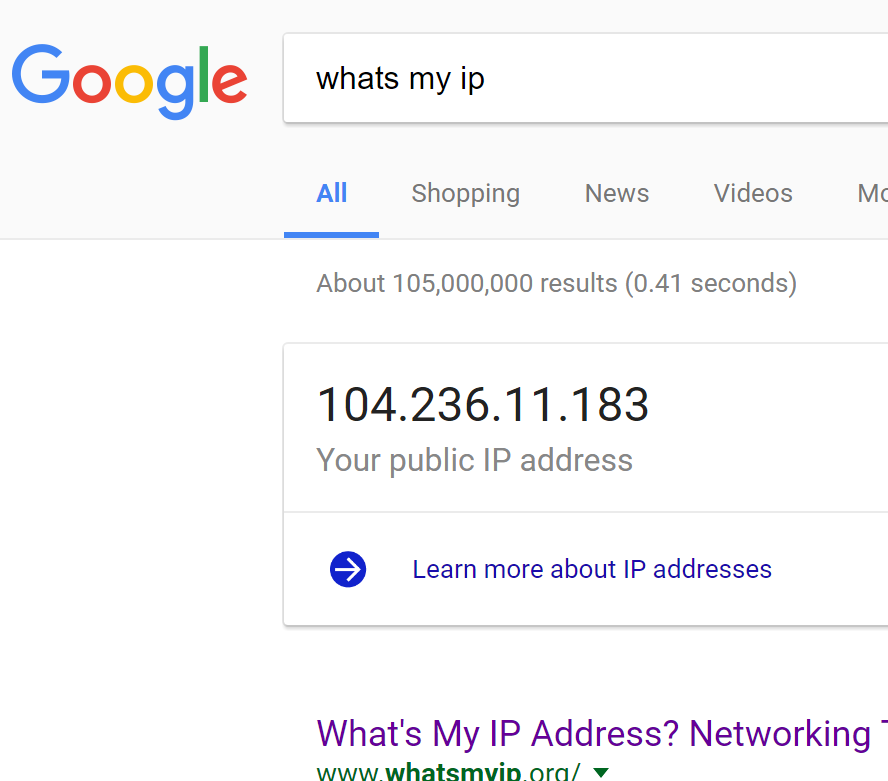
