Installing the Q64 VPN on a Mac
===
Installing the VPN's certificate is the first step, this allows your Mac to validate the authenticity of the VPN upon connection.
Unfortunately the installation of the certificate is not as simple as it is on Windows, but if you follow this guide exactly,
you will have no issues.

1) Click the certificate link labeled OSX on your [account page](http://net.q64.co).  This will download the certificate.

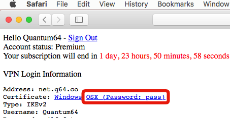

2) Click the certificate in the downloads folder.

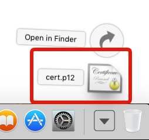

3) Type the certificate's password when prompted, the password is "pass" sans quotes.  Then click OK.

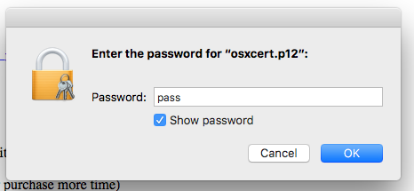

4) The keychain access window will open, right click the Q64 Root Certification Authority entry, then click get info (if right clicking doesn't work, try holding control and clicking).

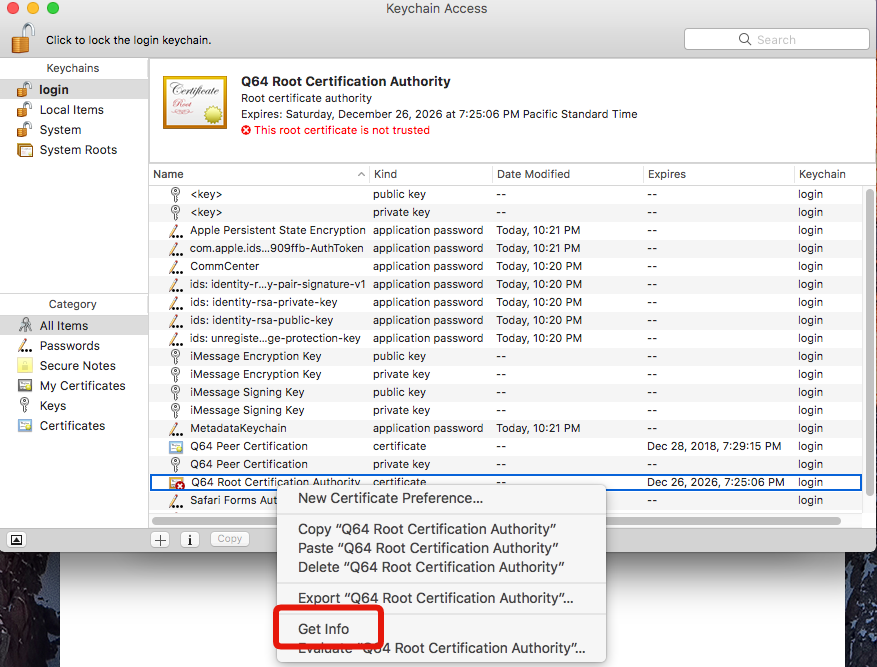

5) Change the first entry in the new window to "Always Trust".

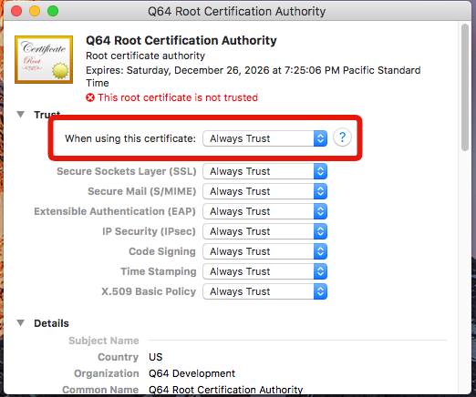

6) Close the "Get Info" window then, when prompted, type your computer account password.

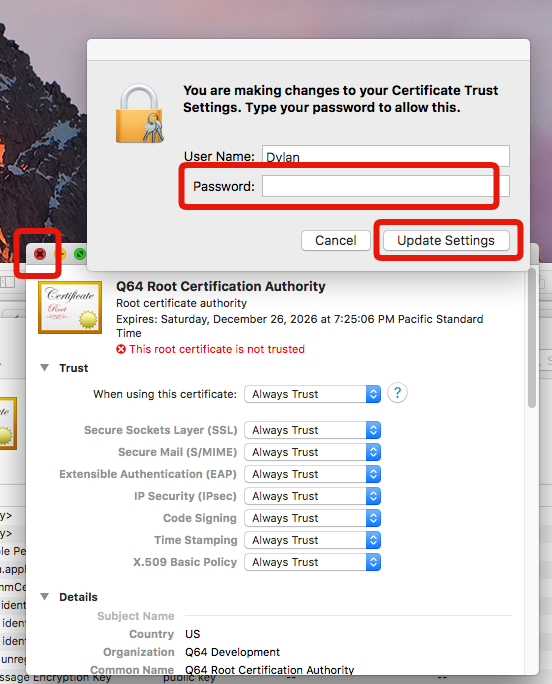

7) Open System Preferences and click Network

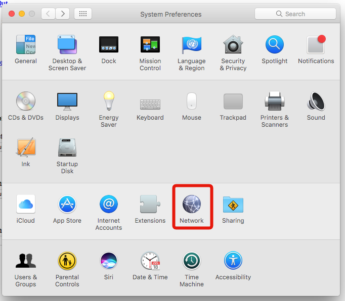

8) Click the plus sign in the bottom left of the window, then change the options on the new window that appears to: Interface: VPN, VPN Type: IKEv2, Service Name: Any name you choose

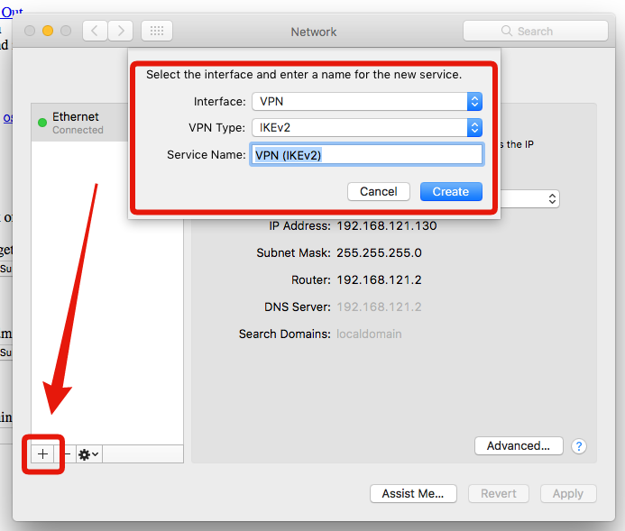

9) Change Server Address and Remote ID to net.q64.co, then click Authentication Settings

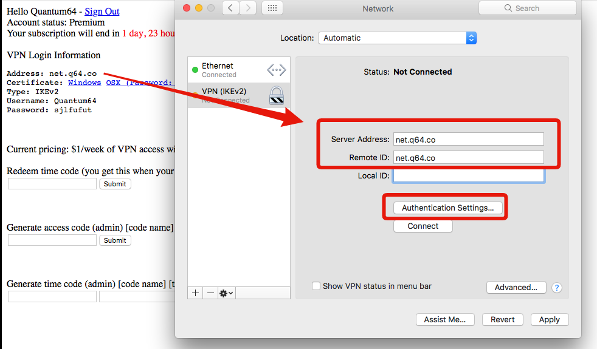

10) Copy the Username and Password from your [account page](http://net.q64.co) into the new window, then click OK.

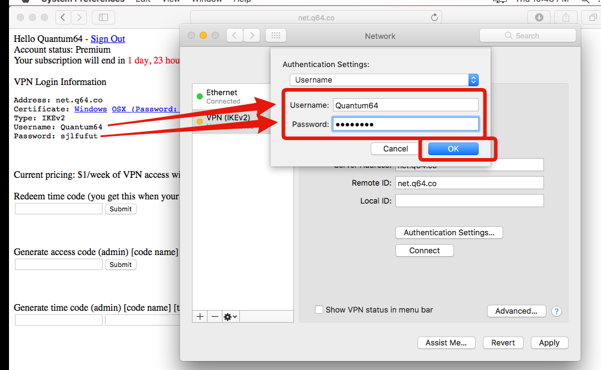

11) Check the "Show VPN status in menu bar" checkbox, click the Apply button in the bottom right, then click the Connect button.

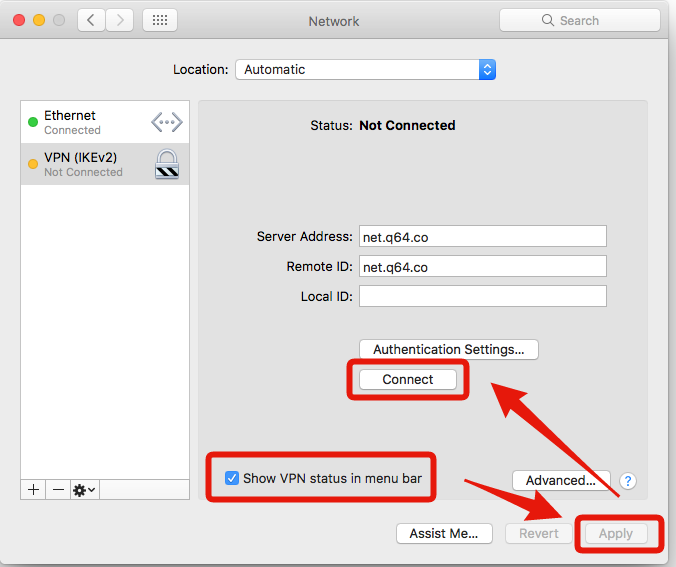

12) You are now connected to the VPN, confirm this by checking your IP address.

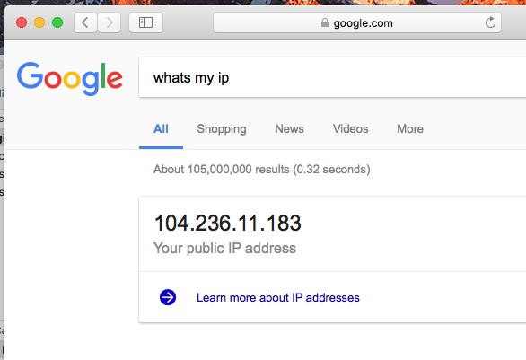
